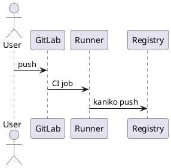
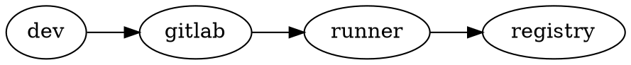

# platform/apps/demo

Demo project provisioned by Ansible (`roles/gitlab_demo`). Shows the full chain:
Kaniko image build → project container registry → GitLab Pages, plus the shared
diagram services rendering inline in Markdown.

- CI/CD: `.gitlab-ci.yml` (kaniko-build + pages)
- Image: pushed to this project's registry (`$CI_REGISTRY_IMAGE`)
- Pages: `public/` served at the project's Pages URL

## Diagrams (rendered by the shared services on lxc-diagrams-01)

PlantUML (standalone plantuml-server):

Graphviz (via Kroki):

Mermaid (GitLab-native):

